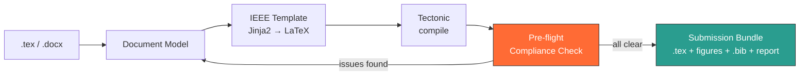

# प्रारूप · Prarup

**Format-compliant research papers — before you submit.**

An offline desktop tool that converts your manuscript to a target conference
template, compiles it live, and verifies it against the submission system's
actual rules while you can still fix things.

`PC503 — Python Programming` · `DA-IICT`

---

## The one-line version

> Overleaf shows you the PDF. IEEE PDF eXpress tells you it is wrong *after* you submit.
> **Prarup tells you while you can still fix it — without your manuscript leaving your laptop.**

---

## The pipeline

---

## Why this exists

The most common reason IEEE rejects a submitted PDF is not in your `.tex` file at all.
It is a font embedded inside a **figure** — Helvetica or Arial, quietly written in by
matplotlib, MATLAB or R when you exported the plot.

You find out on deadline day, from an error message that explains nothing.

Prarup catches it in about thirty lines of PyMuPDF, before you ever open the submission portal.

There is a second, nastier variant. matplotlib's **default** export uses Type3
fonts, which are bitmap-based and rejected by IEEE **even when correctly
embedded** — and Ghostscript cannot repair them. So "fix the fonts" is really two
problems with two different answers, and a tool that does not tell them apart
will report successes it did not achieve. See
[11 · Compliance Rules](docs/11-compliance-rules.md).

---

## Documentation

| Document | What's inside |
|---|---|
| [01 · Problem & Motivation](docs/01-problem.md) | Why formatting compliance is a real, expensive problem |
| [02 · System Architecture](docs/02-architecture.md) | Full pipeline, component diagrams, data flow |
| [03 · Features](docs/03-features.md) | Table stakes vs. our differentiators |
| [04 · UI Design](docs/04-ui-design.md) | Screen layouts, click paths, mockup specs |
| [05 · Python Design](docs/05-python-design.md) | Class hierarchy, ABCs, design decisions |
| [06 · Tech Stack](docs/06-tech-stack.md) | Every library, and why it was chosen |
| [07 · Scope & Timeline](docs/07-scope-and-timeline.md) | What we commit to in four weeks |
| [08 · Presentation Outline](docs/08-presentation-outline.md) | Slide-by-slide deck content |
| [09 · References](docs/09-references.md) | Sources for every claim we make |

### Build documentation

| Document | What's inside |
|---|---|
| [10 · Toolchain](docs/10-toolchain.md) | Every dependency, install commands, Tectonic and Jinja2 configuration traps |
| [11 · Compliance Rules](docs/11-compliance-rules.md) | The rule catalogue — detection code, severity, and remedy for each check |
| [12 · Implementation Notes](docs/12-implementation-notes.md) | QProcess compilation, SyncTeX, log parsing, font inspection |
| [13 · Pitfalls](docs/13-pitfalls.md) | Silent failures, environment traps, demo rehearsal checklist |

---

## Team

| Name | Roll Number |
|---|---|
| Prateek Kalal | 202611009 |
| Om Patel | 202611030 |
| Krushna Parmar | 202611032 |

---

## Status

**Proposal stage.** Architecture and scope finalised; implementation begins after review.

