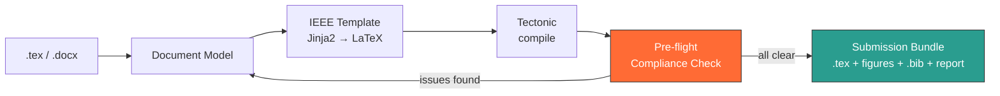
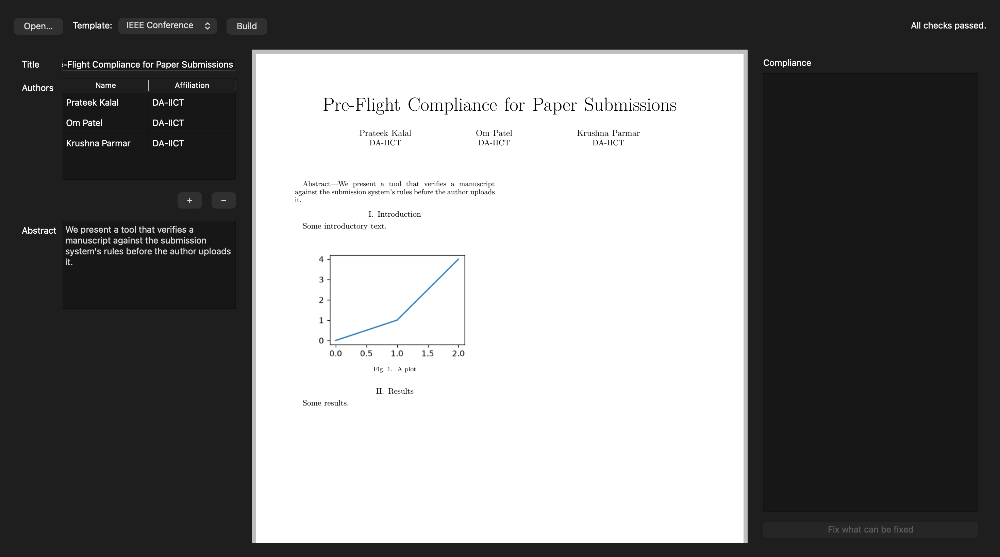

<div align="center">

# प्रारूप · Prarup

**Format-compliant research papers — before you submit.**

An offline desktop tool that converts your manuscript to a target conference
template, compiles it live, and verifies it against the submission system's
actual rules while you can still fix things.

`PC503 — Python Programming` · `DA-IICT`

</div>

---

## The one-line version

> Overleaf shows you the PDF. IEEE PDF eXpress tells you it is wrong *after* you submit.
> **Prarup tells you while you can still fix it — without your manuscript leaving your laptop.**

---

## The pipeline


```mermaid
flowchart LR
    A[".tex / .docx"] --> B["Document Model"]
    B --> C["IEEE Template<br/>Jinja2 → LaTeX"]
    C --> D["Tectonic<br/>compile"]
    D --> E["Pre-flight<br/>Compliance Check"]
    E -->|issues found| B
    E -->|all clear| F["Submission Bundle<br/>.tex + figures + .bib + report"]

    style E fill:#ff6b35,stroke:#333,color:#fff
    style F fill:#2a9d8f,stroke:#333,color:#fff
```

---

## Why this exists

The most common reason IEEE rejects a submitted PDF is not in your `.tex` file at all.
It is a font embedded inside a **figure** — Helvetica or Arial, quietly written in by
matplotlib, MATLAB or R when you exported the plot.

You find out on deadline day, from an error message that explains nothing.

Prarup catches it in about thirty lines of PyMuPDF, before you ever open the submission portal.

There is a second, nastier variant. matplotlib's **default** export uses Type3
fonts, which are bitmap-based and rejected by IEEE **even when correctly
embedded** — and Ghostscript cannot repair them. So "fix the fonts" is really two
problems with two different answers, and a tool that does not tell them apart
will report successes it did not achieve. See
[11 · Compliance Rules](docs/11-compliance-rules.md).

---

## Documentation

| Document | What's inside |
|---|---|
| [01 · Problem & Motivation](docs/01-problem.md) | Why formatting compliance is a real, expensive problem |
| [02 · System Architecture](docs/02-architecture.md) | Full pipeline, component diagrams, data flow |
| [03 · Features](docs/03-features.md) | Table stakes vs. our differentiators |
| [04 · UI Design](docs/04-ui-design.md) | Screen layouts, click paths, mockup specs |
| [05 · Python Design](docs/05-python-design.md) | Class hierarchy, ABCs, design decisions |
| [06 · Tech Stack](docs/06-tech-stack.md) | Every library, and why it was chosen |
| [07 · Scope & Timeline](docs/07-scope-and-timeline.md) | What we commit to in four weeks |
| [08 · Presentation Outline](docs/08-presentation-outline.md) | Slide-by-slide deck content |
| [09 · References](docs/09-references.md) | Sources for every claim we make |

### Build documentation

| Document | What's inside |
|---|---|
| [10 · Toolchain](docs/10-toolchain.md) | Every dependency, install commands, Tectonic and Jinja2 configuration traps |
| [11 · Compliance Rules](docs/11-compliance-rules.md) | The rule catalogue — detection code, severity, and remedy for each check |
| [12 · Implementation Notes](docs/12-implementation-notes.md) | QProcess compilation, SyncTeX, log parsing, font inspection |
| [13 · Pitfalls](docs/13-pitfalls.md) | Silent failures, environment traps, demo rehearsal checklist |
| [14 · How To Build It](docs/14-how-to-build.md) | Minimal design, walking skeleton, the first ten tests, design rules |

---

## Team

| Name | Roll Number |
|---|---|
| Prateek Kalal | 202611009 |
| Om Patel | 202611030 |
| Krushna Parmar | 202611032 |

---

## Quick start

```bash
poetry install
poetry run python tools/make_fixtures.py     # generate test PDFs
poetry run pytest                             # 46 tests
```

External tools: `tectonic` to compile, `pandoc` for `.docx`, `ghostscript` to
repair fonts. On macOS:

```bash
brew install tectonic pandoc ghostscript
```

## Using it

```bash
poetry run prarup build paper.docx \
    --author "Krushna Parmar:DA-IICT" \
    --abstract "A short abstract."          # convert, template, compile, verify

poetry run prarup build paper.tex           # compile, verify
poetry run prarup check paper.pdf           # verify an existing PDF
poetry run prarup check paper.pdf --fix     # repair, then re-verify
poetry run prarup-gui                       # the desktop window
```



Title, authors and abstract are typed in the window, since a `.docx` carries
none of them. The same values are `--title`, `--author` and `--abstract` on the
command line.

A `.docx` is converted to a body fragment, wrapped in the IEEE conference
template, and compiled. A `.tex` is compiled as it stands, because there is no
reliable way to separate an author's preamble from their body.

```
paper.pdf: 1 error(s), 0 warning(s)

  ERROR  FONT-02  EKKAYT+DejaVuSans is a Type3 bitmap font
```

Exit codes: `0` nothing blocking, `1` would be rejected, `2` the tool could not
run. Usable as a gate in a submission script.

`--fix` writes a repaired copy and re-runs every check on it. It never reports a
repair it has not verified, and it never modifies the original.

---

## Status

**v0.7.** Working: `.docx` and `.tex` input, IEEE template rendering, Tectonic
compilation, font, page-limit and encryption checks, YAML rule presets,
Ghostscript repair, and a PySide6 window over all of it.

**Python 3.11 to 3.13.** PySide6 publishes no wheels for 3.14 yet.

87 tests pass, GUI included, headless. Two carry most of the weight: one builds a real paper containing a
default matplotlib figure and confirms the defect is found in the compiled
output, the other takes the `.docx` fixture all the way to a compliant IEEE PDF
and checks the abstract still precedes the body.

Not built yet: the LLM advisory layer. See [14 · How To Build It](docs/14-how-to-build.md).

---

## Team

| Name | Roll Number |
|---|---|
| Prateek Kalal | 202611009 |
| Om Patel | 202611030 |
| Krushna Parmar | 202611032 |

---

## Quick start

```bash
poetry install
poetry run python tools/make_fixtures.py     # generate test PDFs
poetry run pytest                             # 25 tests
```

Check a paper:

```bash
poetry run prarup build paper.tex     # compile, then verify
poetry run prarup check paper.pdf     # verify an existing PDF
```

```
paper.pdf: 1 error(s), 0 warning(s)

  ERROR  FONT-02  EKKAYT+DejaVuSans is a Type3 bitmap font
```

Exit codes: `0` nothing blocking, `1` would be rejected, `2` the tool could not
run. Usable as a gate in a submission script.

---

## Status

**v0.1 works.** The command line tool compiles a `.tex` and reports the font,
page-limit and encryption defects that block submission. 25 tests pass, including
an end-to-end test that builds a real paper containing a default matplotlib
figure and confirms the defect is detected in the compiled output.

Not built yet: `.docx` input, the Qt interface, automatic repair, the LLM
advisory layer. See [14 · How To Build It](docs/14-how-to-build.md).

