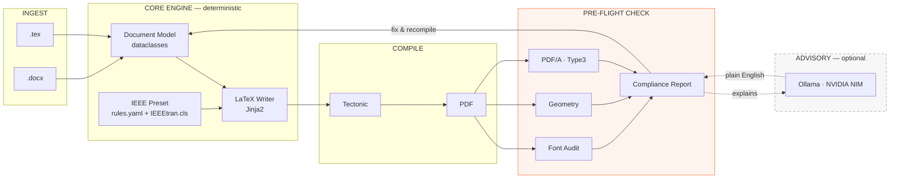
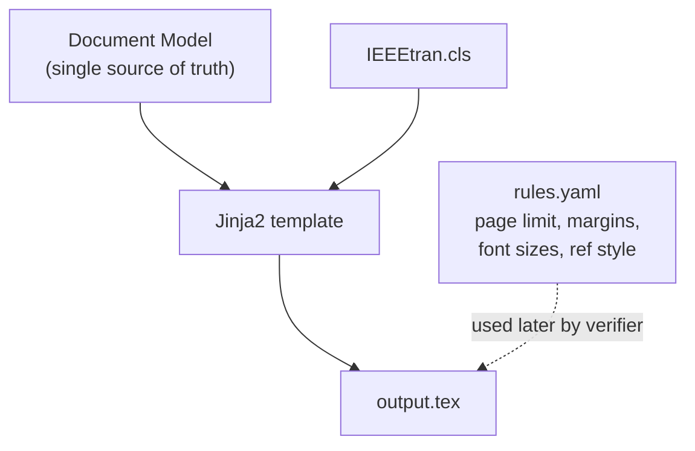
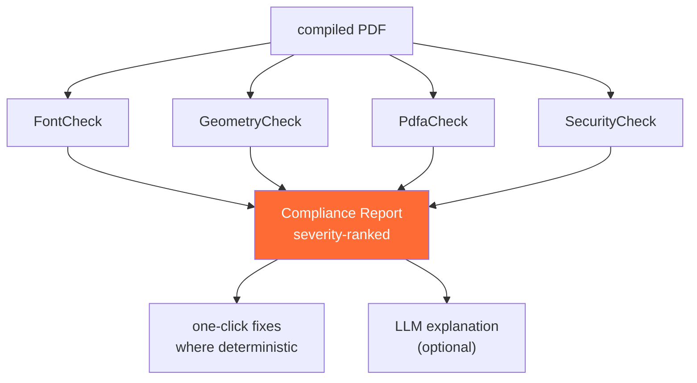
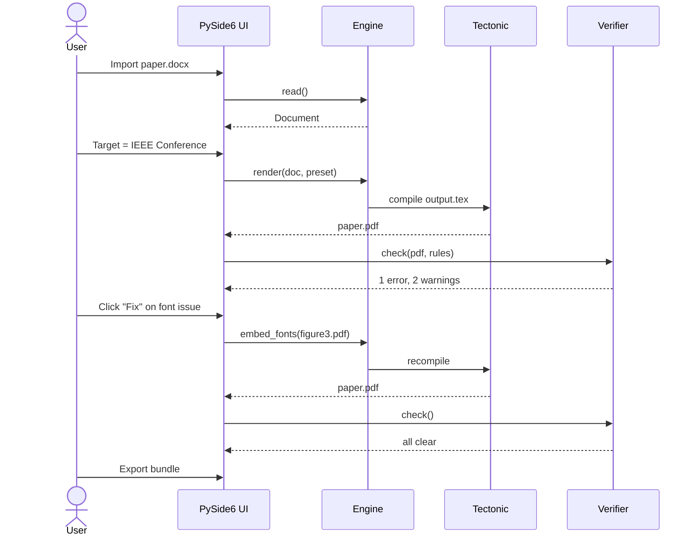

# 02 · System Architecture

## Design principle

> **Rules check. The model only explains.**

Every compliance decision in Prarup is made by deterministic code — geometry,
font tables, page counts. The language model never decides whether something is
compliant and never edits the document on its own. It translates a machine
verdict into readable English and, when asked, suggests options.

Disable the AI entirely and every check still runs. That is not a fallback mode;
it is the default.

---

## Full system diagram



The dashed box is the point of the diagram. The AI sits **beside** the pipeline,
never inside it.

---

## The four stages

### 1 · Ingest

Two readers, one output type. Both produce the same `Document` object, so nothing
downstream needs to know where the manuscript came from.

| Input | Path | Fidelity |
|---|---|---|
| `.tex` | Native parser | Near-lossless — we control the grammar we accept |
| `.docx` | `pypandoc` → LaTeX → model | Good. Images need manual extraction; custom macros break |

PDF input is deliberately **out of scope for v1**. See
[07 · Scope](07-scope-and-timeline.md) for the reasoning.

### 2 · Core engine



A preset is two things: a **LaTeX class file** (how it renders) and a
**`rules.yaml`** (what counts as compliant). Splitting them is what lets us add a
new conference without touching Python — and what lets the LLM generate a draft
preset from a call-for-papers.

### 3 · Compile

**Tectonic**, invoked through `QProcess` so the UI never blocks.

- Self-contained: downloads only the packages the document actually uses
- Runs the correct number of passes automatically — no `latexmk` guesswork
- Users do **not** need a 5 GB TeX Live installation

Auto-compile is debounced at roughly 800 ms of keyboard idle, the same feel as
Overleaf's auto-build.

### 4 · Pre-flight check



Each check is an independent class implementing a common interface. The report is
literally a list comprehension over the registered checks — adding a new rule
means adding one class and one line.

---

## Data flow — one full loop



---

## Module layout

```
prarup/
├── ingest/       tex_reader.py   docx_reader.py
├── model/        document.py          # dataclasses
├── presets/      ieee/rules.yaml      loader.py   generator.py
├── render/       latex_writer.py      asset_manager.py
├── compile/      tectonic.py          log_parser.py   synctex.py
├── verify/       fonts.py  geometry.py  pdfa.py  security.py  report.py
├── llm/          base.py  ollama.py  nim.py  null.py
├── ui/           main_window.py  editor_pane.py  pdf_pane.py
│                 figure_manager.py    report_pane.py
└── tests/                              # verify/ is heavily tested
```

The `model/` package is the spine. Every reader writes into it, every writer reads
from it, and no other module talks across that boundary.

---

**Previous:** [← 01 · Problem](01-problem.md) · **Next:** [03 · Features →](03-features.md)
