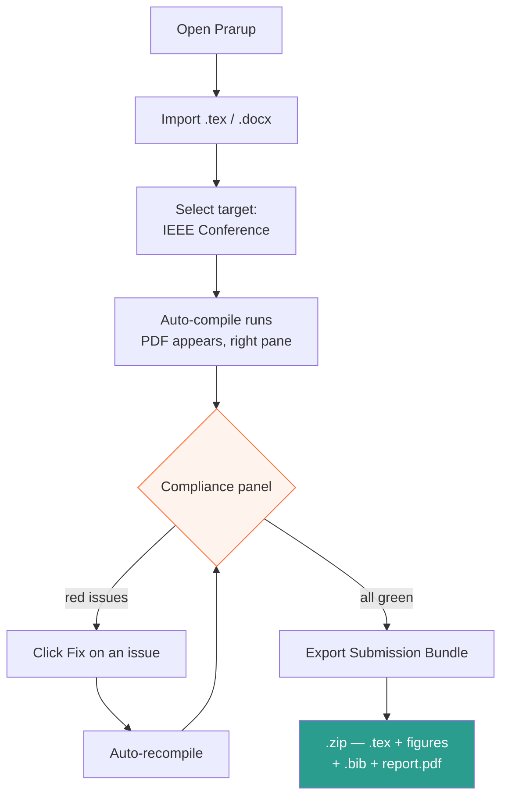

# 04 · UI Design

Built with **PySide6**. Three panes, one status strip, no menus deeper than one level.

---

## Main window

Target canvas **1280 × 800**. Rounded rectangles, hand-drawn style, one accent
colour (orange `#ff6b35`) reserved for actions. Red / amber / green appear only in
the compliance strip so that status reads at a glance.

```
┌──────────────────────────────────────────────────────────────────────┐
│ प्रारूप Prarup   [Import ▾] [Target: IEEE Conference ▾]  ◉ OFFLINE   │  h≈48
├────────────┬───────────────────────────┬─────────────────────────────┤
│ OUTLINE    │  EDITOR                   │  PDF PREVIEW                │
│ w≈200      │  w≈480                    │  w≈480                      │
│            │                           │                             │
│ Title      │ ┌───────────────────────┐ │  ┌───────────────────────┐  │
│ Abstract   │ │ ## 1. Introduction    │ │  │ ░░░░░  ░░░░░          │  │
│ 1. Intro   │ │ Lorem ipsum dolor...  │ │  │ ░░░░░  ░░░░░          │  │
│ 2. Related │ └───────────────────────┘ │  │ ░░░░░  ▣▣▣▣▣          │  │
│ 3. Method  │ ┌───────────────────────┐ │  │ ░░░░░  ░░░░░          │  │
│ 4. Results │ │ [Fig 3] ▣  caption…   │ │  │                       │  │
│ ─────────  │ │ [edit] [replace]      │ │  │        page 1 / 6     │  │
│ Figures(3) │ └───────────────────────┘ │  └───────────────────────┘  │
│ Tables (2) │                           │   ◀  ▶          [Export ⬇] │
│ Refs  (24) │                           │                             │
├────────────┴───────────────────────────┴─────────────────────────────┤
│ COMPLIANCE   ⛔ 1 error   ⚠ 2 warnings   ✓ 9 passed        [▲ expand]│  h≈56
└──────────────────────────────────────────────────────────────────────┘
```

### Pane responsibilities

| Pane | Widget | Job |
|---|---|---|
| Outline | `QTreeWidget` | Jump to any section, figure, table |
| Editor | `QPlainTextEdit` + `QSyntaxHighlighter` | Edit content, not LaTeX boilerplate |
| Preview | `QPdfView` | Live PDF, SyncTeX click-to-jump both ways |
| Compliance | Custom `QWidget`, collapsible | Always visible summary; expands to detail |

---

## Compliance panel — expanded

This is the screen that sells the project. Draw it carefully.

```
┌──────────────────────────────────────────────────────────────────────┐
│  PRE-FLIGHT COMPLIANCE  —  IEEE Conference (6 pages)        [▼ hide] │
├──────────────────────────────────────────────────────────────────────┤
│ ⛔  Non-embedded font in figure                                      │
│     Fig. 3 · figure3.pdf · Helvetica                                 │
│     IEEE PDF eXpress will reject this file.        [Fix] [Show me]   │
├──────────────────────────────────────────────────────────────────────┤
│ ⚠   Over page limit by 0.4 pages                                     │
│     Cheapest cuts:  Fig. 3 width −0.18pp · §4.2 −0.11pp   [Suggest]  │
├──────────────────────────────────────────────────────────────────────┤
│ ⚠   Type3 bitmap font detected — page 4              [Fix] [Ignore]  │
├──────────────────────────────────────────────────────────────────────┤
│ ✓  Margins  ✓ Column width  ✓ Font sizes  ✓ PDF/A-1b  ✓ No security │
│ ✓  Reference style  ✓ Caption placement  ✓ No bookmarks  ✓ 6 pages  │
└──────────────────────────────────────────────────────────────────────┘
```

Passed checks stay on screen, collapsed into two lines. Seeing nine green ticks is
what makes the one red item feel actionable rather than alarming.

---

## Click path



Five clicks from an unformatted manuscript to a verified submission archive.

---

## Interaction rules

1. **Nothing blocks.** Compilation runs in a `QThread`; the editor stays live.
2. **No silent edits.** Every automatic fix shows exactly what it changed before applying.
3. **Offline is visible.** The toggle sits in the title bar, not buried in settings.
4. **Errors are human.** LaTeX log lines are parsed into sentences, with the raw log one click away.

---

## Drawing these mockups

Use **Excalidraw** with the specs above. Keep the hand-drawn stroke style — it
reads as *we designed this*, which is the impression you want in a proposal.

- Font: Excalidraw's default hand-drawn
- Single accent: orange `#ff6b35` for buttons and the compliance header
- Status colours only: `⛔ #e63946` · `⚠ #f4a261` · `✓ #2a9d8f`
- Grey placeholder bars `░░░` for body text in the PDF preview
- Export at 2× scale for slide clarity

---

**Previous:** [← 03 · Features](03-features.md) · **Next:** [05 · Python Design →](05-python-design.md)
