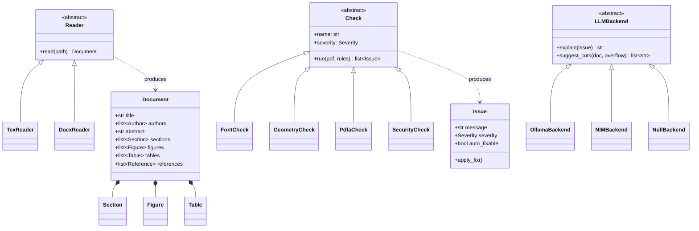

# 05 · Python Design

PC503 is a Python subject, so the object model is not incidental — it is part of
the deliverable. This document explains what we are building and, more
importantly, *why the structure is shaped this way*.

---

## Class diagram



---

## Three abstract base classes, three reasons

### `Reader` — because input formats will grow

```python
class Reader(ABC):
    @abstractmethod
    def read(self, path: Path) -> Document: ...
```

Adding PDF support later means writing `PdfReader(Reader)` and registering it.
Nothing downstream changes, because everything downstream only knows `Document`.

This is the whole argument for having a document model at all.

### `Check` — because rules are data, not code paths

```python
class Check(ABC):
    name: str
    severity: Severity

    @abstractmethod
    def run(self, pdf: Path, rules: dict) -> list[Issue]: ...
```

The entire compliance report is then:

```python
report = [issue for check in REGISTRY for issue in check.run(pdf, rules)]
```

A new conference requirement becomes one new class and one registry entry.
No `if/elif` chain anywhere in the codebase.

### `LLMBackend` — because the AI must be optional

```python
class NullBackend(LLMBackend):
    def explain(self, issue: Issue) -> str:
        return issue.message          # the rule already said it plainly
```

`NullBackend` is not a stub. It is the **default**, and it is why the claim
"works fully offline with no model" is structurally true rather than a promise.

---

## Where each concept is used

| Python concept | Where | Why there |
|---|---|---|
| `ABC` / `@abstractmethod` | `Reader`, `Check`, `LLMBackend` | Three genuine plug-in points |
| `@dataclass` | `Document`, `Section`, `Figure`, `Issue` | Pure data; no behaviour to hide |
| `Enum` | `Severity` (ERROR / WARNING / PASS) | Fixed, ordered vocabulary |
| Composition | `Document` *contains* sections and figures | A figure is not a kind of document |
| Inheritance | Only the three ABC families | Used where substitutability is real |
| `pathlib.Path` | Everywhere | No string path concatenation |
| `QThread` | Compile loop | Keeps the UI responsive |
| Context managers | Temp build directories | Guaranteed cleanup after compile |
| Type hints | Whole codebase | Checked with `mypy` |
| `pytest` | `verify/` especially | Pure functions over fixture PDFs — trivially testable |

---

## Why the verifier is the best-tested module

Every check is a pure function of *(PDF, rules) → issues*. No UI, no network,
no state. That makes it the one part of the system where a test suite is genuinely
meaningful:

```python
def test_detects_unembedded_helvetica():
    issues = FontCheck().run(FIXTURE / "matplotlib_bad.pdf", IEEE_RULES)
    assert any("Helvetica" in i.message for i in issues)

def test_clean_pdf_passes():
    assert FontCheck().run(FIXTURE / "clean.pdf", IEEE_RULES) == []
```

We ship fixture PDFs — one deliberately broken matplotlib export, one clean —
so the tests prove the flagship feature actually works.

---

## What we deliberately avoided

- **No god class.** There is no `PrarupApp` that knows everything.
- **No inheritance for code reuse.** Shared helpers are functions, not base classes.
- **No LLM in the object graph's critical path.** `Check` has no reference to `LLMBackend`; the UI joins them at the last moment.

---

**Previous:** [← 04 · UI Design](04-ui-design.md) · **Next:** [06 · Tech Stack →](06-tech-stack.md)
