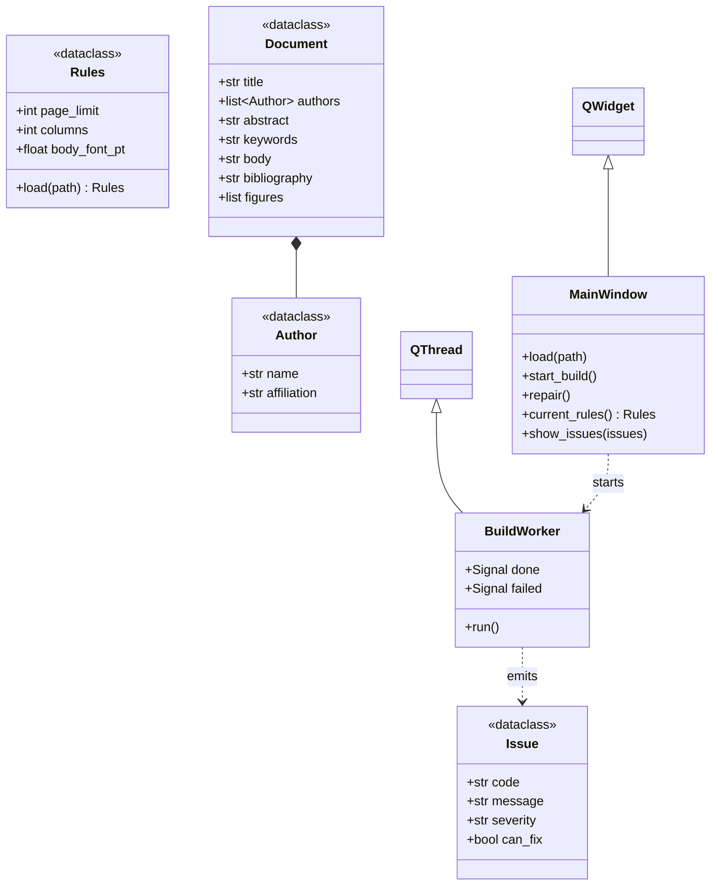

# 05 · Python Design

PC503 is a Python subject, so the object model is not incidental. It is part of
the deliverable. This document describes the structure that was **actually
built**, and why it is shaped this way.

> **Changed from the proposal.** The first version of this document designed
> three abstract base classes (`Reader`, `Check`, `LLMBackend`) before any code
> existed. When we built it, none of them earned their place: there was one
> reader per format, the checks were plain functions, and the LLM layer is not
> built yet. [14 · How To Build It](14-how-to-build.md) explains the rule we
> followed instead: *no abstraction until you have written the same thing twice.*

---

## What exists


```mermaid
classDiagram
    class Issue {
        <<dataclass>>
        +str code
        +str message
        +str severity
        +bool can_fix
    }
    class Rules {
        <<dataclass>>
        +int page_limit
        +int columns
        +float body_font_pt
        +load(path) Rules
    }
    class Author {
        <<dataclass>>
        +str name
        +str affiliation
    }
    class Document {
        <<dataclass>>
        +str title
        +list~Author~ authors
        +str abstract
        +str keywords
        +str body
        +str bibliography
        +list figures
    }
    class QWidget
    class QThread
    class MainWindow {
        +load(path)
        +start_build()
        +repair()
        +current_rules() Rules
        +show_issues(issues)
    }
    class BuildWorker {
        +Signal done
        +Signal failed
        +run()
    }

    QWidget <|-- MainWindow
    QThread <|-- BuildWorker
    Document *-- Author
    MainWindow ..> BuildWorker : starts
    BuildWorker ..> Issue : emits
```

Everything else is a **plain function**.

| File | Contents | Kind |
|---|---|---|
| `models.py` | `Issue`, `Rules`, `Author`, `Document` | dataclasses, no logic beyond `Rules.load` |
| `checks.py` | `check_fonts`, `check_page_count`, `check_security`, `check_bookmarks`, `run_all_checks` | pure functions: PDF path in, list of `Issue` out |
| `document.py` | `document_from_latex` | pure string work |
| `render.py` | `render(document, template)` | pure: Jinja2 template to a string |
| `convert.py` | `docx_to_tex`, `find_custom_macros` | runs pandoc |
| `compile.py` | `compile_pdf` | runs Tectonic |
| `fix.py` | `embed_fonts` | runs Ghostscript |
| `main.py` | argparse command line | entry point |
| `gui.py` | `MainWindow`, `BuildWorker`, `build_paper` | entry point |

---

## Why functions, not a `Check` class hierarchy

A check takes a PDF and returns problems. It holds no state between calls, so a
class would add a constructor and a `self` and nothing else.

```python
def run_all_checks(pdf_path, rules):
    issues = []
    issues += check_fonts(pdf_path)
    issues += check_page_count(pdf_path, rules)
    issues += check_security(pdf_path)
    issues += check_bookmarks(pdf_path)
    issues.sort(key=lambda issue: issue.severity != "error")
    return issues
```

Adding a rule is one function and one line here. That is the same extension
cost the class registry promised, without the registry.

---

## Where classes are genuinely used

| Class | Why it is a class |
|---|---|
| `Issue`, `Rules`, `Author`, `Document` | They hold data. `@dataclass` gives equality and a readable `repr`, which makes test failures easy to read. |
| `Rules.load` (classmethod) | An alternative constructor that reads YAML and **rejects unknown keys**, so a typo in a preset fails loudly. |
| `MainWindow(QWidget)` | Real inheritance: Qt requires it, and the window holds all its widgets as state. |
| `BuildWorker(QThread)` | Real inheritance: runs the pipeline off the UI thread and reports back through Qt **signals**. |
| `UnreadablePdf`, `TectonicNotFound`, `PandocNotFound`, `ConversionFailed`, `GhostscriptNotFound`, `RepairFailed` | Custom exceptions, so each failure reaches the user as one clear sentence. |

---

## The one architectural rule, enforced by a test

`checks.py` must never touch the outside world: no `subprocess`, no Qt, no
network. `tests/test_layering.py` reads the source and fails if any of those
names appear. That keeps the checks fast, deterministic and trivially testable.

---

## Python concepts used, and where

| Concept | Where |
|---|---|
| `@dataclass`, `field(default_factory=list)` | `models.py` |
| `@classmethod` alternative constructor | `Rules.load` |
| Inheritance from a framework class | `MainWindow(QWidget)`, `BuildWorker(QThread)` |
| Signals and slots, worker thread | `BuildWorker.done` / `.failed` |
| Custom exceptions, `raise ... from` | `checks.py`, `compile.py`, `convert.py`, `fix.py` |
| `pathlib.Path` throughout | every module |
| `subprocess.run` with captured output | `compile.py`, `convert.py`, `fix.py` |
| Regular expressions | `document.py` (headings, figure placement), `convert.py` (macros) |
| Jinja2 with custom delimiters | `render.py` |
| `argparse` subcommands, exit codes | `main.py` |
| Type hints | function signatures |
| `pytest` fixtures, `tmp_path`, `monkeypatch`, `pytest-qt` | `tests/`, 105 tests |

---

## Not built yet

The optional LLM layer. When it is built, the plan is still that **rules check
and the model only explains**: the model would receive an `Issue` and return
text, and nothing in `checks.py` would reference it.

---

**Previous:** [← 04 · UI Design](04-ui-design.md) · **Next:** [06 · Tech Stack →](06-tech-stack.md)
