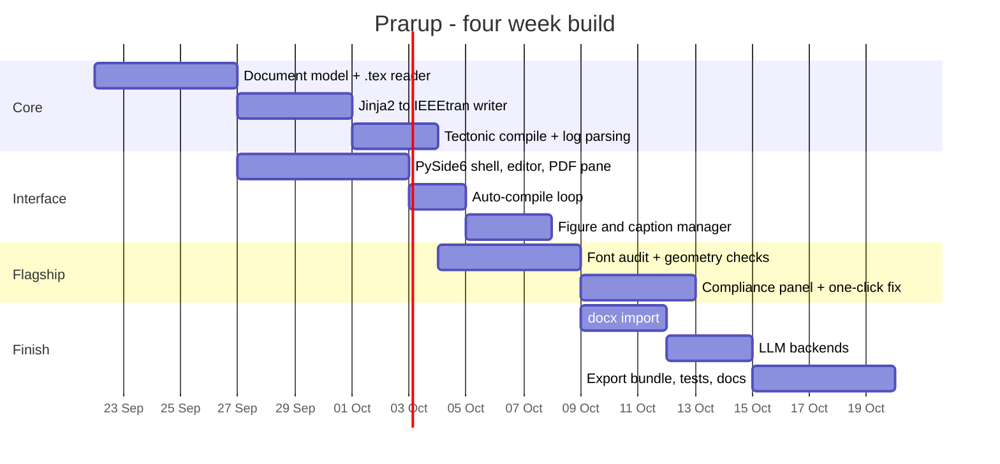

# 07 · Scope & Timeline

Four weeks. Three people. The scope below is what we will actually finish, not
what would be impressive to promise.

---

## In scope — v1

- ✅ `.tex` and `.docx` input
- ✅ IEEE Conference output (IEEEtran)
- ✅ Live auto-compile with embedded PDF preview
- ✅ **Pre-flight compliance checker** — the flagship
- ✅ Figure, table and caption management
- ✅ Submission bundle export
- ✅ Fully functional with AI disabled

## Out of scope — v1

| Deferred | Why |
|---|---|
| **PDF input** | The best open extractors reach only ~83% structure accuracy on born-digital PDFs, and far worse on scanned ones. Doing it properly is a project of its own; doing it badly would make the demo look broken. |
| ACM / Springer / Elsevier presets | The architecture supports them — a preset is a `.cls` plus a `rules.yaml`. Adding one is a day's work once the first is complete. Breadth is not the point of v1. |
| Auto-generated presets from a CFP | Designed and specified, implemented only if the core lands early. |
| Conversion diff between templates | Genuinely useful, genuinely additional. |
| Reference-manager import (Zotero, Mendeley) | Well-understood, no research risk, purely time. |

> We would rather support one conference completely than four badly.

---

## Four-week plan

### Week by week

| Week | Milestone | Demoable? |
|---|---|---|
| **1** | Document model, `.tex` reader, LaTeX writer, compile from CLI | Terminal only |
| **2** | PySide6 shell with editor + live PDF preview | **Yes — looks like a real app** |
| **3** | Compliance checker and panel wired in | **Yes — this is the pitch** |
| **4** | `.docx`, LLM backends, export bundle, tests, polish | Full demo |

**Week 2 gives us something to show. Week 3 gives us something to argue.**
Everything in week 4 is upside, so the project cannot end with nothing.

---

## Risks and mitigations

| Risk | Likelihood | Mitigation |
|---|---|---|
| `.docx` conversion mangles equations | High | Detect `\newcommand` and custom macros, warn the user explicitly rather than failing silently |
| Tectonic behaves differently across macOS / Windows | Medium | Pin the version; test on all three machines from week 1 |
| PySide6 packaging pain with PyInstaller | Medium | Run from source for the demo; packaging is a stretch goal |
| Template licensing | Low | IEEEtran is LPPL, redistribution permitted. Springer and Elsevier terms must be checked individually before any future bundling |
| Scope creep | **High** | This document. Anything not in the "in scope" list is a v2 conversation |

---

## Definition of done

A person can take a `.docx` manuscript they wrote, open Prarup, select IEEE
Conference, watch it compile, see a real compliance error caused by a real
matplotlib figure, click one button to fix it, and export an archive that passes
IEEE PDF eXpress.

If that works end to end, v1 is complete.

---

**Previous:** [← 06 · Tech Stack](06-tech-stack.md) · **Next:** [08 · Presentation Outline →](08-presentation-outline.md)
